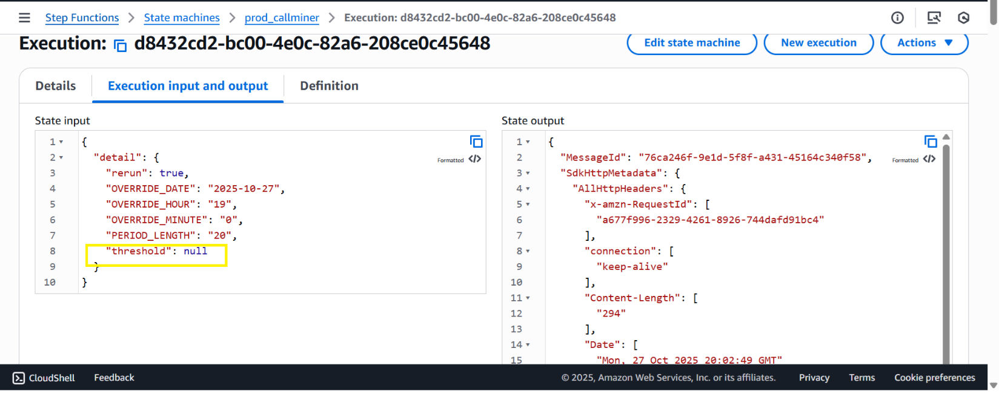
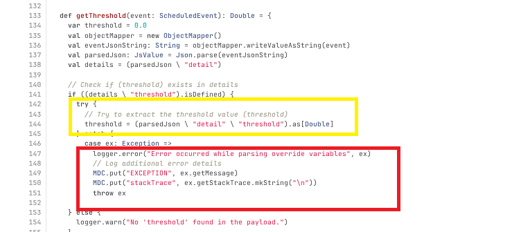
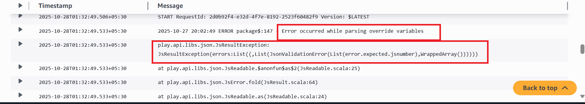
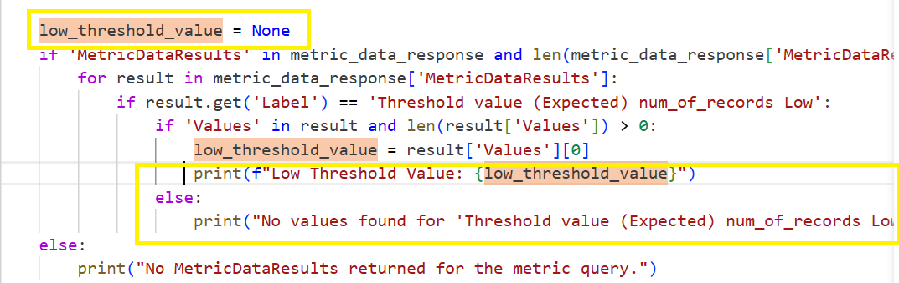
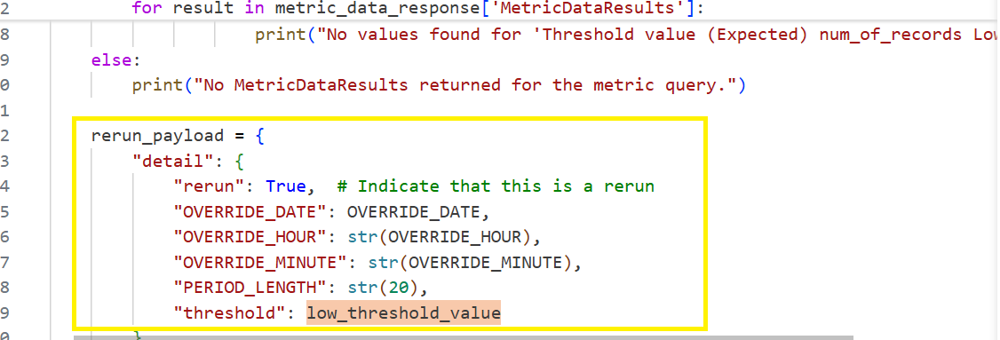
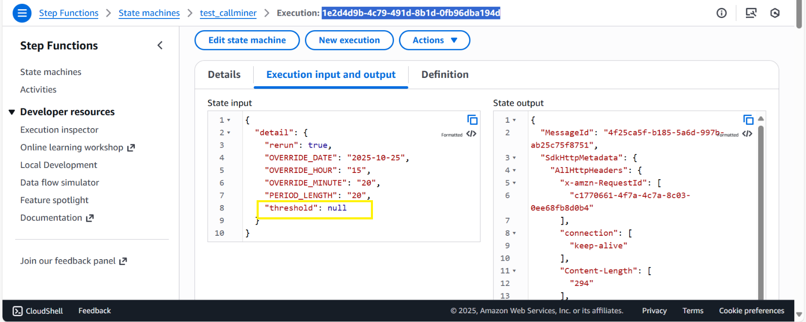

# CALLMINER TIMEOUT

CALLMINER Step Function was Failed with the ERROR of **Callminer lamda
function failed after 3 attempts or function Timeout.**

Execution : \[
[d8432cd2-bc00-4e0c-82a6-208ce0c45648](https://eu-west-1.console.aws.amazon.com/states/home?region=eu-west-1#/v2/executions/details/arn:aws:states:eu-west-1:729864353414:execution:prod_callminer:d8432cd2-bc00-4e0c-82a6-208ce0c45648)
\]

Lambda Log : \[ [Cloud Watch
Log](https://eu-west-1.console.aws.amazon.com/cloudwatch/home?region=eu-west-1#logsV2:log-groups/log-group/$252Faws$252Flambda$252Fprod-ingestion-callminer-landing/log-events/2025$252F10$252F27$252F$255B$2524LATEST$255D114b5de5ca4d4287bd627c4305f15f7f)
\]

More information on the error is present in the GitHub thread :
<https://github.com/d2iq-archive/marathon/issues/887>

Analysis:

On Oct 27th CallMiner Step function when running with re-run
mode the execution of the same failed in the Landing Lambda Function,
retry of the same didn’t have any effect. The failure of the lambda was
like below:

The reason for the above failure is with the way the input is being
passed to the Step Function with re-run, this re-run had the input of
threshold mapped to as **null,** when the functional block to fetch the
threshold parameter and use it was executed the error was thrown
pointing out that same was unable to be used.

Above is the function from which we fetch the threshold value and cast
it as Double, however when we have passed null it gets mapped as JsNull
and it would be unable to map it to the Double ending in raising and
catching of the exception.

This is the point of failure and seems to be a bug existing from how we
handle threshold key pairing in the input, from the present setup in
case of re-run we should have this mapped to an actual correct value.
Because further down the lane fetched threshold value will be used as a
low-end threshold to cross verify with the re-run fetched result set and
compare the same in case of fetched is less than threshold set then an
alarm on the same is triggered so ideally, we should never have
threshold as null in case of rerun which omits the use case of re-run
itself.

Why Null?

The Reason is with the lambda callminer-rerun which triggers the
callminer stepfunction with required rerun parameters. \[ [Cloud Watch
Log](https://eu-west-1.console.aws.amazon.com/cloudwatch/home?region=eu-west-1#logsV2:log-groups/log-group/$252Faws$252Flambda$252Fprod-ingestion-callminer-rerun-lambda/log-events/2025$252F10$252F27$252F$255B$2524LATEST$255D0f5269634d934bef8ce295f3f7119748)
\] is the log of the run which triggered the threshold as null, here as
we can see there is nothing in the values from which we can pick and
pass as low threshold into the step function however due to non return
condition present it mapped the initial value assigned to the
low\_threshold\_value which was none.

As a result, the threshold value came as None.

**From the looks of it the rerun lambda logic of fetching the threshold
value needs correction to make sure no None value is passed.**

Replication:

Have replicated the same issue in the test environment by setting
threshold as null and the same error and slack alert was pushed.

TEST Execution : \[
[1e2d4d9b-4c79-491d-8b1d-0fb96dba194d](https://eu-west-1.console.aws.amazon.com/cloudwatch/home?region=eu-west-1#logsV2:log-groups/log-group/$252Faws$252Flambda$252Ftest-ingestion-callminer-landing/log-events/2025$252F10$252F28$252F$255B$2524LATEST$255Df91700a42fb14362966d73ed280e64b1)
\]

Lambda Log : \[ [Cloud Watch
Log](https://eu-west-1.console.aws.amazon.com/cloudwatch/home?region=eu-west-1#logsV2:log-groups/log-group/$252Faws$252Flambda$252Ftest-ingestion-callminer-landing/log-events/2025$252F10$252F28$252F$255B$2524LATEST$255Df91700a42fb14362966d73ed280e64b1)
\]

